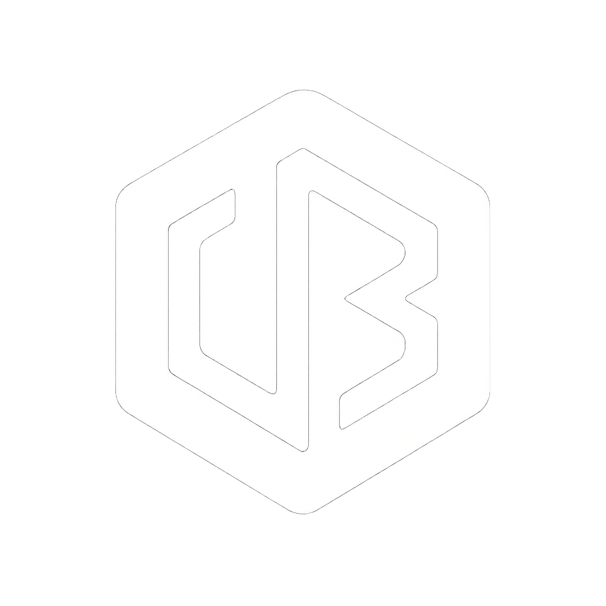

  

<h1 align="center">Bonjour, je suis vonboss</h1>

  <strong>Developpeur Full-Stack</strong> chez <strong>VB Creation</strong>

---

### A propos

- Developpeur passione par le web, l'IA et la blockchain
- Fondateur de **VB Creation**
- Toujours en train d'apprendre et de construire

---

### Technologies & Outils

---

### Projets phares

| Projet | Description |
|--------|-------------|
| **Bot Trading Crypto IA** | Systeme avance de trading crypto avec microservices et Machine Learning |
| **Companion Dev** | Interface Web & Mobile pour Claude Code & Codex |
| **Gantt BTP** | Application de gestion de projet pour le secteur BTP / Pierre naturelle |

---

### Stats GitHub

  

---

  <i>« Construire, automatiser, innover. »</i>

